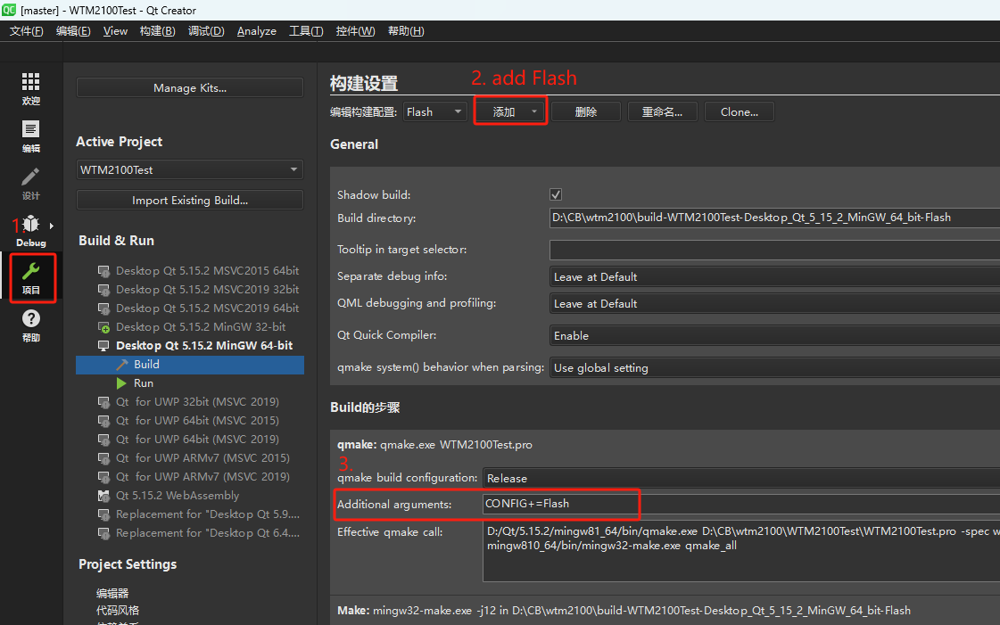
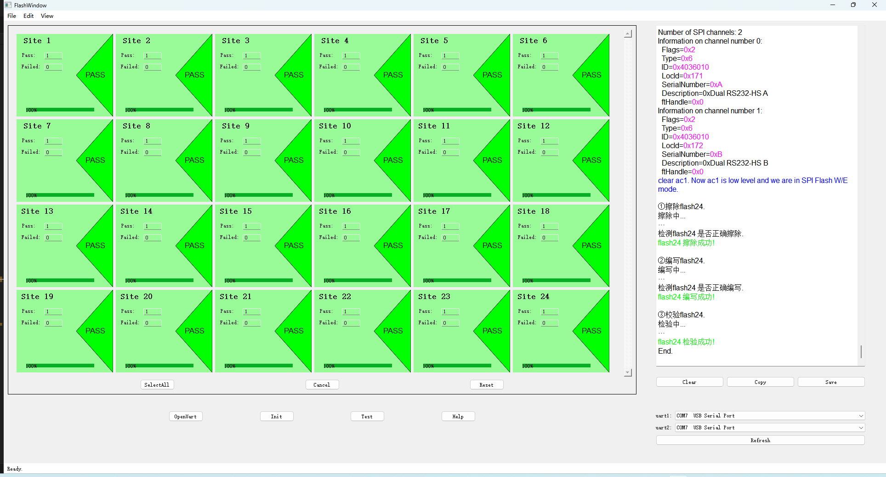
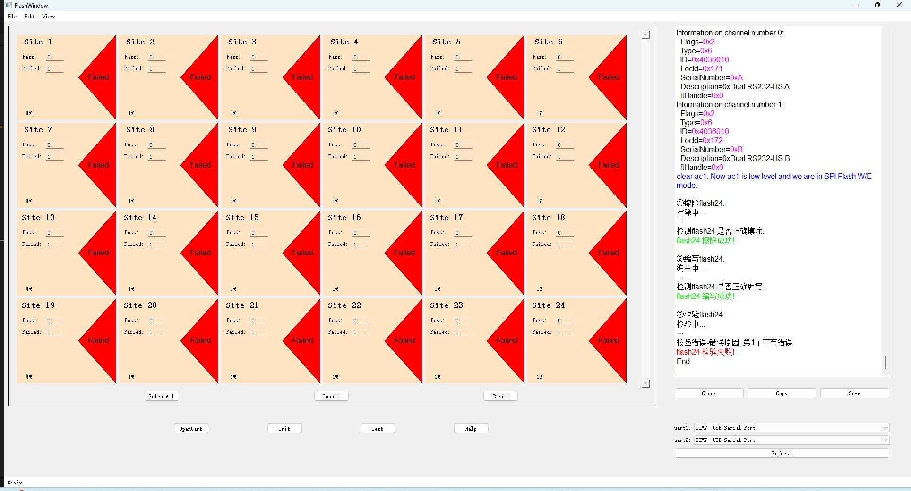

# FlashEWTools
## Introduction
- This is a software that erase/write ```W25Q64FW flash``` with the help of ```MPSSE_SPI``` library. This desktop tool based on ```QT5``` is used for flash/write/read operations in the industrial field. So before using the software, you need to have at least one operational ```flash``` and a 'USB to serial port' FT2232H tool. Of course, the library file ```libMPSSE.dll``` is neccessary.
- 这是一款借助```MPSSE_SPI```库擦写```W25Q64FW Flash```的软件。这款基于 ```QT5``` 开发的桌面工具用于工业领域的```Flash```擦/写/读操作。因此，在使用该软件之前，需要至少有一个可操作的Flash和一个USB转串口的FT2232H工具。当然，库文件```libMPSSE.dll```也是必需的。
## Environment
- Qt5.15.2 + QtCreator/vscode + minGW
- libMPSSE.dll + libMPSSE_spi.h + ftd2xx.h
- windows10/11
## References
- [MPSSE-SPI参考文档](https://ftdichip.com/document/application-notes/)：Used to understand ```SPI APIs```
- [FTDI_FT2232H参考文档](https://ftdichip.com/product-category/products/)：Used to understand ```FT2232 Pins```
- [D2XX参考文档](https://ftdichip.com/drivers/d2xx-drivers/)：Used to understand ```FT APIs```
## Usage
### Configure the project.<br>
Please add ```CONFIG+=Flash``` in the *Additional arguments* textEdit.<br>
<br>
### Build<br>
**Note:** Before build, please change the build target from *Debug/Release* to *Flash*.
### Run<br>
```cd output/bin/ui```<br>
```FlashWidget24Sites.exe```
### Use Tool
- Click help button to find how to use it.
- As shown in the figure, this is the interface effect after all 24 flashes are successfully erased/written.<br>
<br>
- As shown in the figure, this is the interface effect after all 24 flashes are failed erased/written.<br>
<br>
## Attention
- **Note:** The total erase/write/read time for each flash is approximately 85 seconds.
- **Note:** My code sets the AC1 pin low. This is our FPGA requirements. Depending on the situation, you can choose whether or not to comment the line of code.